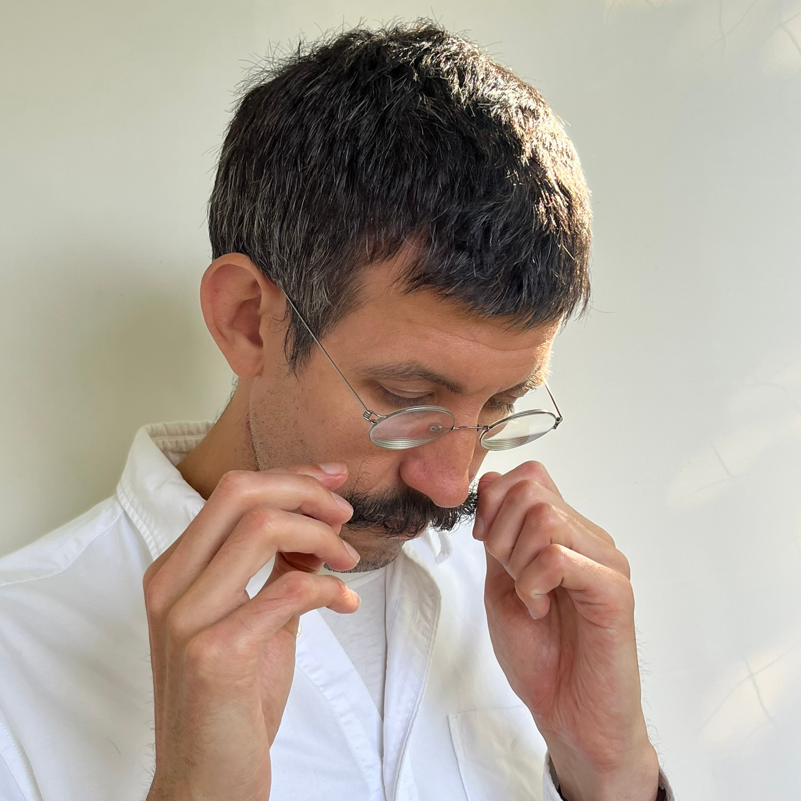

```{raw} html
<div class="mobile-logo">
    
</div>
```

```{raw} html
<div class="big-code">
<pre>Mobilising Optimal Scalar Transport
using semidefinite programmes</pre>
</div>
```
```{raw} html
<div style="margin-bottom: 2rem;"></div>
```  

```{figure} _static/simulations.png
:alt: A description of the image
:width: 100%
:align: left    ← left, center, or right
:name: fig-label ← lets you cross-reference it elsewhere
```

Fluid flows can transport scalars such as heat, pollutants, and other quantities in complex ways. This project develops new mathematical and computational tools to identify globally optimal flows for scalar transport, by reformulating problems involving the Navier-Stokes equations as Semidefinite Programmes (SDPs). Unlike traditional non-convex approaches using brute-force numerical simulations, SDPs are convex optimization problems so one can solve them systematically. This offers an exciting new approach for both theoretical and applied investigation of optimal transport problems in fluid mechanics.

<!-- ```{math} -->
<!-- \min\limits_{u}\max\limits_{\phi}\mathcal{J}(u)+\langle \varepsilon, \phi\rangle -->
<!-- ``` -->


# Team

```{raw} html
<div class="team-grid">
  <div class="team-card">
    <a href="https://profiles.imperial.ac.uk/a.wynn">
      
    </a>
    <a href="https://profiles.imperial.ac.uk/a.wynn"> Andrew Wynn</a>
    <p>Project Lead</p>
  </div>
  <div class="team-card">
    <a href="https://profiles.imperial.ac.uk/john.craske07">
      
    </a>
    <a href="https://profiles.imperial.ac.uk/john.craske07"> John Craske</a>
    <p>Project co-Lead</p>
  </div>
  <div class="team-card">
    <a href="https://dcn.nat.fau.eu/giovanni-fantuzzi">
      
    </a>
    <a href="https://dcn.nat.fau.eu/giovanni-fantuzzi">Giovanni Fantuzzi</a>
    <p>Visiting Researcher</p>
  </div>
</div>
```

# Recommended reading

A general introduction for how SDPs can be used to solve theoretical problems in
fluid mechanics is given in {cite}`fantuzzi2022`, with applications including
studying convective heat transfer problems {cite}`arslan2021a` and shear-driven
flows {cite}`fantuzzi2016`. The aim of `MOST:def` is to use SDP analysis to
solve optimal transport problems, an introduction to which can be found in
{cite}`tobasco2017, tobasco2022`.

```{bibliography}
:filter: keywords % "MOST_def_reading"

```

```{raw} html
<div class="figure-row">
    <figure>
        
    </figure>
    <figure>
        
    </figure>
</div>
```


